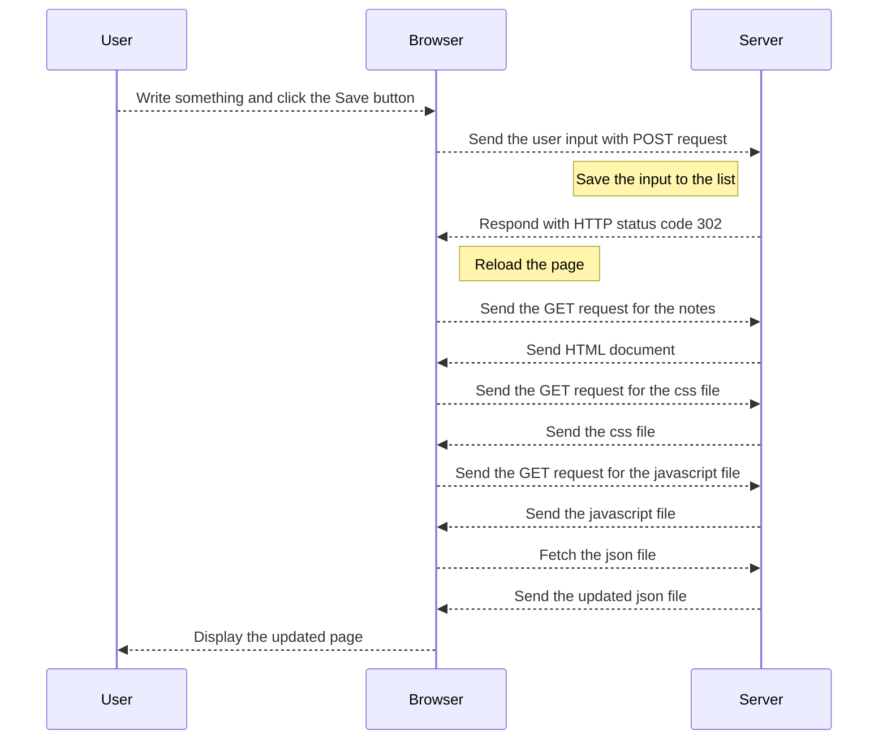

# ex4

```mermaid
sequenceDiagram
    participant User
    participant Browser
    participant Server

    User-->>Browser: Write something and click the Save button
    Browser-->>Server: Send the user input with POST request
    Note left of Server: Save the input to the list
    Server-->>Browser: Respond with HTTP status code 302
    Note right of Browser: Reload the page
    Browser-->>Server: Send the GET request for the notes
    Server-->>Browser: Send HTML document
    Browser-->>Server: Send the GET request for the css file
    Server-->>Browser: Send the css file
    Browser-->>Server: Send the GET request for the javascript file
    Server-->>Browser: Send the javascript file
    Browser-->>Server: Fetch the json file
    Server-->>Browser: Send the updated json file
    Browser-->>User: Display the updated page
```