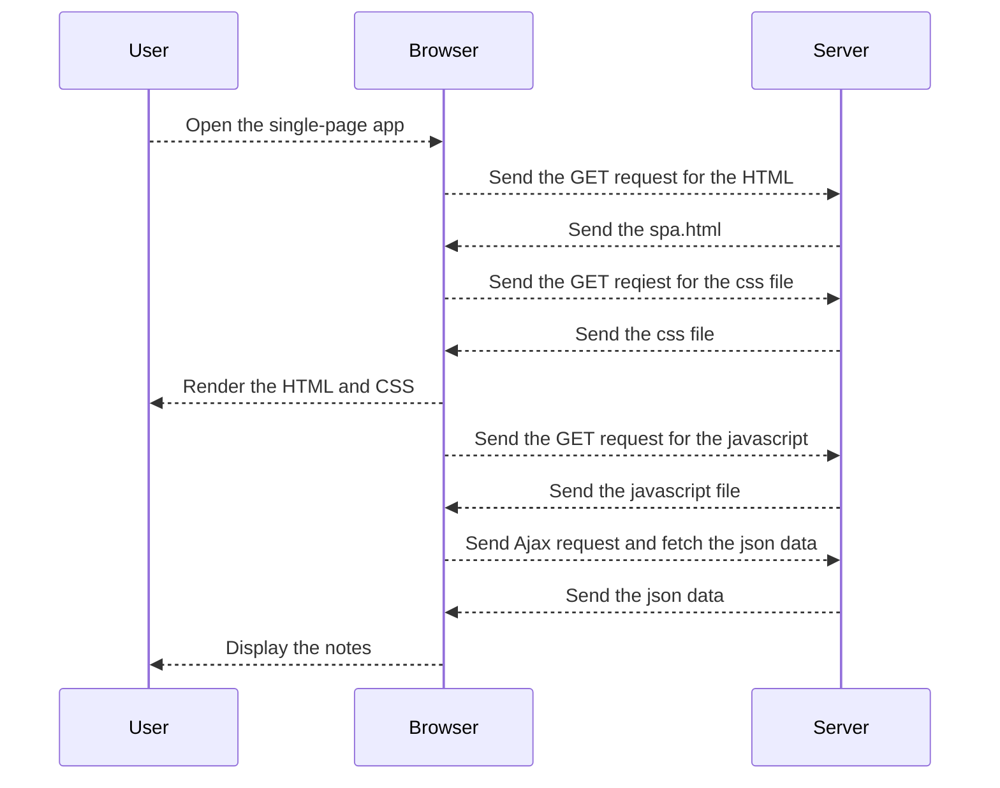

# ex5

```mermaid
sequenceDiagram
    participant User
    participant Browser
    participant Server

User-->>Browser: Open the single-page app
Browser-->>Server: Send the GET request for the HTML
Server-->>Browser: Send the spa.html
Browser-->>Server: Send the GET reqiest for the css file
Server-->>Browser: Send the css file 
Browser-->>User: Render the HTML and CSS
Browser-->>Server: Send the GET request for the javascript
Server-->>Browser: Send the javascript file 
Browser-->>Server: Send Ajax request and fetch the json data
Server-->>Browser: Send the json data
Browser-->>User: Display the notes

```