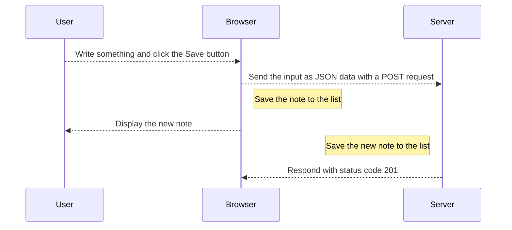

# ex6

```mermaid
sequenceDiagram
    participant User
    participant Browser
    participant Server

User-->> Browser: Write something and click the Save button
Browser-->> Server: Send the input as JSON data with a POST request
Note right of Browser: Save the note to the list
Browser-->> User: Display the new note
Note left of Server: Save the new note to the list
Server-->>Browser: Respond with status code 201
```